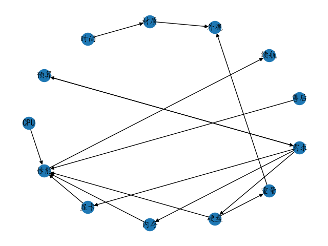

系统工程ISM模型脚本

## 环境准备

```shell
python install -r requirement.txt
```

## 数据准备

修改`ism.py`里的nodes为带计算的节点


`data.csv`内为节点的依赖关系，可以是矩阵或者是列表，从1开始计数

生成的所有矩阵会保存为csv文件

## 运行示例

```python
python ism.py -d data.csv -t list -o output.png
==========original matrix A==========
+------+-------+--------+--------+--------+--------+--------+--------+--------+--------+--------+--------+--------+--------+
|      |   CPU |   显卡 |   内存 |   硬盘 |   需求 |   预算 |   售后 |   性能 |   续航 |   外观 |   重量 |   材质 |   时尚 |
|------+-------+--------+--------+--------+--------+--------+--------+--------+--------+--------+--------+--------+--------|
| CPU  |     0 |      0 |      0 |      0 |      0 |      0 |      0 |      1 |      0 |      0 |      0 |      0 |      0 |
| 显卡 |     0 |      0 |      0 |      0 |      0 |      0 |      0 |      1 |      0 |      0 |      0 |      0 |      0 |
| 内存 |     0 |      0 |      0 |      0 |      0 |      0 |      0 |      1 |      0 |      0 |      0 |      0 |      0 |
| 硬盘 |     0 |      0 |      0 |      0 |      0 |      0 |      0 |      1 |      0 |      0 |      1 |      0 |      0 |
| 需求 |     0 |      1 |      1 |      1 |      0 |      1 |      0 |      1 |      0 |      1 |      0 |      0 |      0 |
| 预算 |     0 |      0 |      0 |      0 |      1 |      0 |      0 |      0 |      0 |      0 |      0 |      0 |      0 |
| 售后 |     0 |      0 |      0 |      0 |      0 |      0 |      0 |      1 |      0 |      0 |      0 |      0 |      0 |
| 性能 |     0 |      0 |      0 |      0 |      0 |      0 |      0 |      0 |      1 |      0 |      0 |      0 |      0 |
| 续航 |     0 |      0 |      0 |      0 |      0 |      0 |      0 |      0 |      0 |      0 |      0 |      0 |      0 |
| 外观 |     0 |      0 |      0 |      0 |      0 |      0 |      0 |      0 |      0 |      0 |      0 |      0 |      0 |
| 重量 |     0 |      0 |      0 |      0 |      0 |      0 |      0 |      0 |      0 |      1 |      0 |      0 |      0 |
| 材质 |     0 |      0 |      0 |      0 |      0 |      0 |      0 |      0 |      0 |      1 |      0 |      0 |      0 |
| 时尚 |     0 |      0 |      0 |      0 |      0 |      0 |      0 |      0 |      0 |      1 |      0 |      1 |      0 |
+------+-------+--------+--------+--------+--------+--------+--------+--------+--------+--------+--------+--------+--------+
==========adjacent matrix I==========
+------+-------+--------+--------+--------+--------+--------+--------+--------+--------+--------+--------+--------+--------+
|      |   CPU |   显卡 |   内存 |   硬盘 |   需求 |   预算 |   售后 |   性能 |   续航 |   外观 |   重量 |   材质 |   时尚 |
|------+-------+--------+--------+--------+--------+--------+--------+--------+--------+--------+--------+--------+--------|
| CPU  |     1 |      0 |      0 |      0 |      0 |      0 |      0 |      1 |      0 |      0 |      0 |      0 |      0 |
| 显卡 |     0 |      1 |      0 |      0 |      0 |      0 |      0 |      1 |      0 |      0 |      0 |      0 |      0 |
| 内存 |     0 |      0 |      1 |      0 |      0 |      0 |      0 |      1 |      0 |      0 |      0 |      0 |      0 |
| 硬盘 |     0 |      0 |      0 |      1 |      0 |      0 |      0 |      1 |      0 |      0 |      1 |      0 |      0 |
| 需求 |     0 |      1 |      1 |      1 |      1 |      1 |      0 |      1 |      0 |      1 |      0 |      0 |      0 |
| 预算 |     0 |      0 |      0 |      0 |      1 |      1 |      0 |      0 |      0 |      0 |      0 |      0 |      0 |
| 售后 |     0 |      0 |      0 |      0 |      0 |      0 |      1 |      1 |      0 |      0 |      0 |      0 |      0 |
| 性能 |     0 |      0 |      0 |      0 |      0 |      0 |      0 |      1 |      1 |      0 |      0 |      0 |      0 |
| 续航 |     0 |      0 |      0 |      0 |      0 |      0 |      0 |      0 |      1 |      0 |      0 |      0 |      0 |
| 外观 |     0 |      0 |      0 |      0 |      0 |      0 |      0 |      0 |      0 |      1 |      0 |      0 |      0 |
| 重量 |     0 |      0 |      0 |      0 |      0 |      0 |      0 |      0 |      0 |      1 |      1 |      0 |      0 |
| 材质 |     0 |      0 |      0 |      0 |      0 |      0 |      0 |      0 |      0 |      1 |      0 |      1 |      0 |
| 时尚 |     0 |      0 |      0 |      0 |      0 |      0 |      0 |      0 |      0 |      1 |      0 |      1 |      1 |
+------+-------+--------+--------+--------+--------+--------+--------+--------+--------+--------+--------+--------+--------+
==========reachable matrix M==========
r = 3 # 可达矩阵的传递次数
+------+-------+--------+--------+--------+--------+--------+--------+--------+--------+--------+--------+--------+--------+
|      |   CPU |   显卡 |   内存 |   硬盘 |   需求 |   预算 |   售后 |   性能 |   续航 |   外观 |   重量 |   材质 |   时尚 |
|------+-------+--------+--------+--------+--------+--------+--------+--------+--------+--------+--------+--------+--------|
| CPU  |     1 |      0 |      0 |      0 |      0 |      0 |      0 |      1 |      1 |      0 |      0 |      0 |      0 |
| 显卡 |     0 |      1 |      0 |      0 |      0 |      0 |      0 |      1 |      1 |      0 |      0 |      0 |      0 |
| 内存 |     0 |      0 |      1 |      0 |      0 |      0 |      0 |      1 |      1 |      0 |      0 |      0 |      0 |
| 硬盘 |     0 |      0 |      0 |      1 |      0 |      0 |      0 |      1 |      1 |      1 |      1 |      0 |      0 |
| 需求 |     0 |      1 |      1 |      1 |      1 |      1 |      0 |      1 |      1 |      1 |      1 |      0 |      0 |
| 预算 |     0 |      1 |      1 |      1 |      1 |      1 |      0 |      1 |      1 |      1 |      1 |      0 |      0 |
| 售后 |     0 |      0 |      0 |      0 |      0 |      0 |      1 |      1 |      1 |      0 |      0 |      0 |      0 |
| 性能 |     0 |      0 |      0 |      0 |      0 |      0 |      0 |      1 |      1 |      0 |      0 |      0 |      0 |
| 续航 |     0 |      0 |      0 |      0 |      0 |      0 |      0 |      0 |      1 |      0 |      0 |      0 |      0 |
| 外观 |     0 |      0 |      0 |      0 |      0 |      0 |      0 |      0 |      0 |      1 |      0 |      0 |      0 |
| 重量 |     0 |      0 |      0 |      0 |      0 |      0 |      0 |      0 |      0 |      1 |      1 |      0 |      0 |
| 材质 |     0 |      0 |      0 |      0 |      0 |      0 |      0 |      0 |      0 |      1 |      0 |      1 |      0 |
| 时尚 |     0 |      0 |      0 |      0 |      0 |      0 |      0 |      0 |      0 |      1 |      0 |      1 |      1 |
+------+-------+--------+--------+--------+--------+--------+--------+--------+--------+--------+--------+--------+--------+
level_set: [['续航', '外观'], ['性能', '重量', '材质'], ['CPU', '显卡', '内存', '硬盘', '售后', '时尚'], ['需求', '预算']] # 每个子列表代表一个层次，从左到右依次递增
==========reduced matrix M'==========
+-------------+-------+--------+--------+--------+---------------+--------+--------+--------+--------+--------+--------+--------+
|             |   CPU |   显卡 |   内存 |   硬盘 |   需求 + 预算 |   售后 |   性能 |   续航 |   外观 |   重量 |   材质 |   时尚 |
|-------------+-------+--------+--------+--------+---------------+--------+--------+--------+--------+--------+--------+--------|
| CPU         |     1 |      0 |      0 |      0 |             0 |      0 |      1 |      1 |      0 |      0 |      0 |      0 |
| 显卡        |     0 |      1 |      0 |      0 |             0 |      0 |      1 |      1 |      0 |      0 |      0 |      0 |
| 内存        |     0 |      0 |      1 |      0 |             0 |      0 |      1 |      1 |      0 |      0 |      0 |      0 |
| 硬盘        |     0 |      0 |      0 |      1 |             0 |      0 |      1 |      1 |      1 |      1 |      0 |      0 |
| 需求 + 预算 |     0 |      1 |      1 |      1 |             1 |      0 |      1 |      1 |      1 |      1 |      0 |      0 |
| 售后        |     0 |      0 |      0 |      0 |             0 |      1 |      1 |      1 |      0 |      0 |      0 |      0 |
| 性能        |     0 |      0 |      0 |      0 |             0 |      0 |      1 |      1 |      0 |      0 |      0 |      0 |
| 续航        |     0 |      0 |      0 |      0 |             0 |      0 |      0 |      1 |      0 |      0 |      0 |      0 |
| 外观        |     0 |      0 |      0 |      0 |             0 |      0 |      0 |      0 |      1 |      0 |      0 |      0 |
| 重量        |     0 |      0 |      0 |      0 |             0 |      0 |      0 |      0 |      1 |      1 |      0 |      0 |
| 材质        |     0 |      0 |      0 |      0 |             0 |      0 |      0 |      0 |      1 |      0 |      1 |      0 |
| 时尚        |     0 |      0 |      0 |      0 |             0 |      0 |      0 |      0 |      1 |      0 |      1 |      1 |
+-------------+-------+--------+--------+--------+---------------+--------+--------+--------+--------+--------+--------+--------+
strong_node_pairs: {5: [6]}
==========backbone matrix M'==========
+-------------+-------+--------+--------+--------+---------------+--------+--------+--------+--------+--------+--------+--------+
|             |   CPU |   显卡 |   内存 |   硬盘 |   需求 + 预算 |   售后 |   性能 |   续航 |   外观 |   重量 |   材质 |   时尚 |
|-------------+-------+--------+--------+--------+---------------+--------+--------+--------+--------+--------+--------+--------|
| CPU         |     0 |      0 |      0 |      0 |             0 |      0 |      1 |      0 |      0 |      0 |      0 |      0 |
| 显卡        |     0 |      0 |      0 |      0 |             0 |      0 |      1 |      0 |      0 |      0 |      0 |      0 |
| 内存        |     0 |      0 |      0 |      0 |             0 |      0 |      1 |      0 |      0 |      0 |      0 |      0 |
| 硬盘        |     0 |      0 |      0 |      0 |             0 |      0 |      1 |      0 |      0 |      1 |      0 |      0 |
| 需求 + 预算 |     0 |      1 |      1 |      1 |             0 |      0 |      0 |      0 |      0 |      0 |      0 |      0 |
| 售后        |     0 |      0 |      0 |      0 |             0 |      0 |      1 |      0 |      0 |      0 |      0 |      0 |
| 性能        |     0 |      0 |      0 |      0 |             0 |      0 |      0 |      1 |      0 |      0 |      0 |      0 |
| 续航        |     0 |      0 |      0 |      0 |             0 |      0 |      0 |      0 |      0 |      0 |      0 |      0 |
| 外观        |     0 |      0 |      0 |      0 |             0 |      0 |      0 |      0 |      0 |      0 |      0 |      0 |
| 重量        |     0 |      0 |      0 |      0 |             0 |      0 |      0 |      0 |      1 |      0 |      0 |      0 |
| 材质        |     0 |      0 |      0 |      0 |             0 |      0 |      0 |      0 |      1 |      0 |      0 |      0 |
| 时尚        |     0 |      0 |      0 |      0 |             0 |      0 |      0 |      0 |      0 |      0 |      1 |      0 |
```


`output.png`为生成的梯阶模型雏形（具体的层次划分需要根据打印的level_set再进行划分）

